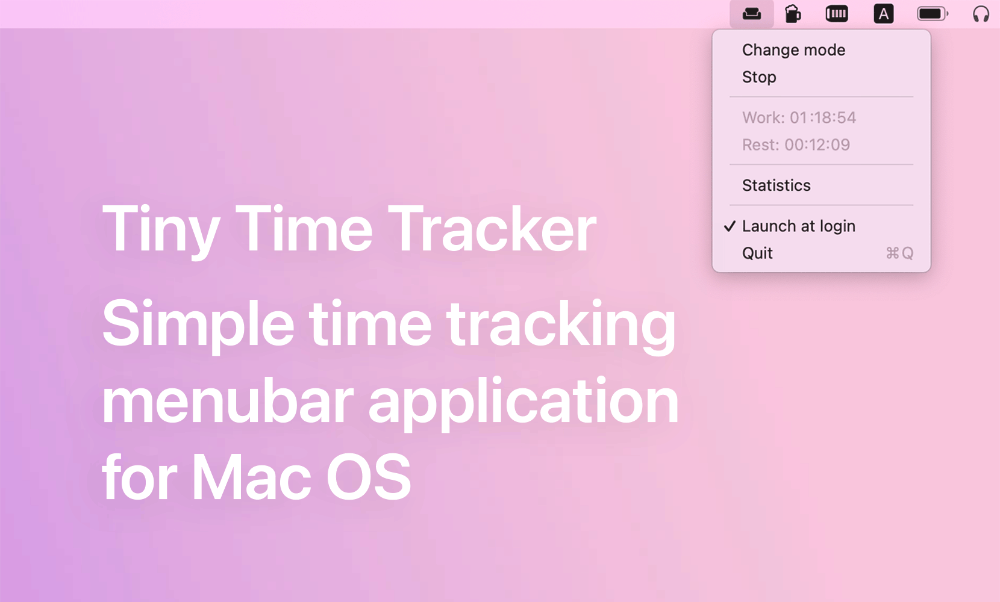

## SimpleTimeTracker

This a simple time tracking application. Supports two working modes: "Work" and "Rest" and is able to save statistics to a file.

## Install

### Manually
Download from the [Releases](https://github.com/nyok/TinyTimeTracker/releases) page.

### Autostart
The program doesn't have an option to autostart itself.
To add a program to startup open _System Preferences_ -> _Users & Groups_ -> _Login Items_ and add the application to the list.

## Statistics
By default, a file with statistical data is created in the user's folder: `/Users/username/Documents/TinyTimeTracker.txt`

## Language: 
- English
- Russian

## License
Icon is [Material design icons is the official icon set from Google](https://github.com/google/material-design-icons/).
